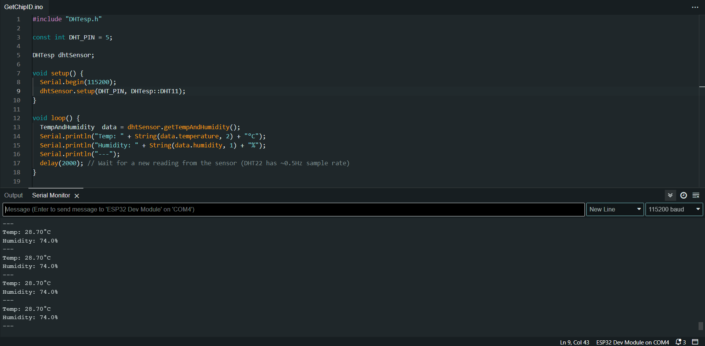
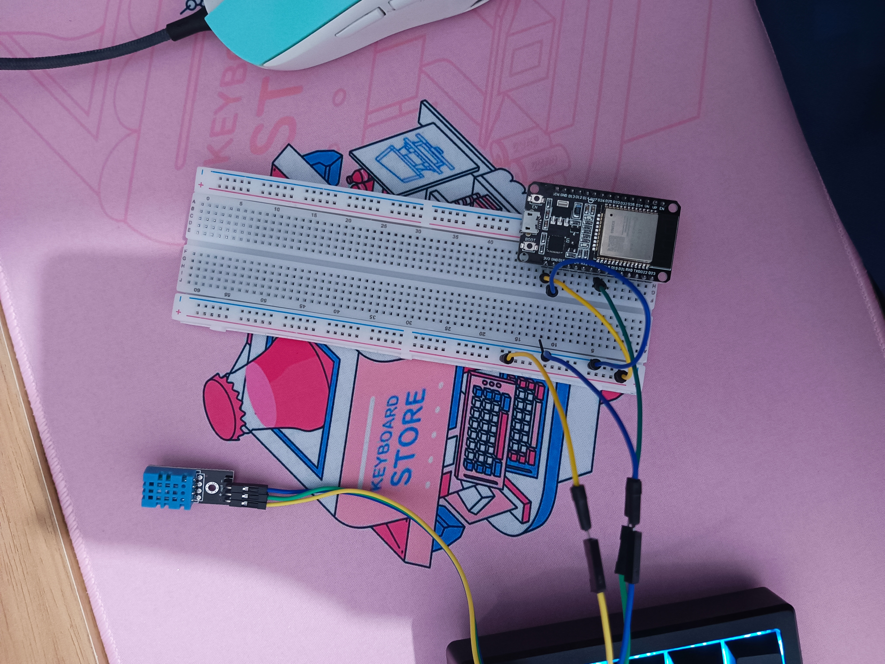

# Laporan Praktikum IoT

## 📌 Identitas Kelompok

- **Muhammad Yoanvari Al Farizi** (**2241720096**)
- **Mozzarino khaira akbar** (**2241720**)
- **Ratnasari** (**2241720007**)
- **Riski Abdi Rahmawan** (**2241720060**)
- **Sandra Devia Arge** (**2241720222**)

## 📖 Deskripsi Proyek

Proyek ini bertujuan untuk **mengukur suhu dan kelembaban menggunakan sensor DHT11 yang terhubung dengan ESP32**, lalu menampilkan data melalui **Serial Monitor**.

## 🛠️ Hardware yang Digunakan

- **ESP32**
- **Sensor DHT11**
- **Sordeless Breadboard**
- **Jumper Wires**
- **Power Supply (USB ke ESP32)**

## 📜 Source Code

```cpp
#include "DHTesp.h"

const int DHT_PIN = 5;

DHTesp dhtSensor;

void setup() {
  Serial.begin(115200);
  dhtSensor.setup(DHT_PIN, DHTesp::DHT11);
}

void loop() {
  TempAndHumidity  data = dhtSensor.getTempAndHumidity();
  Serial.println("Temp: " + String(data.temperature, 2) + "°C");
  Serial.println("Humidity: " + String(data.humidity, 1) + "%");
  Serial.println("---");
  delay(2000);
}
```

## 📸 Screenshot Arduino IDE



## 📷 Foto Hardware


